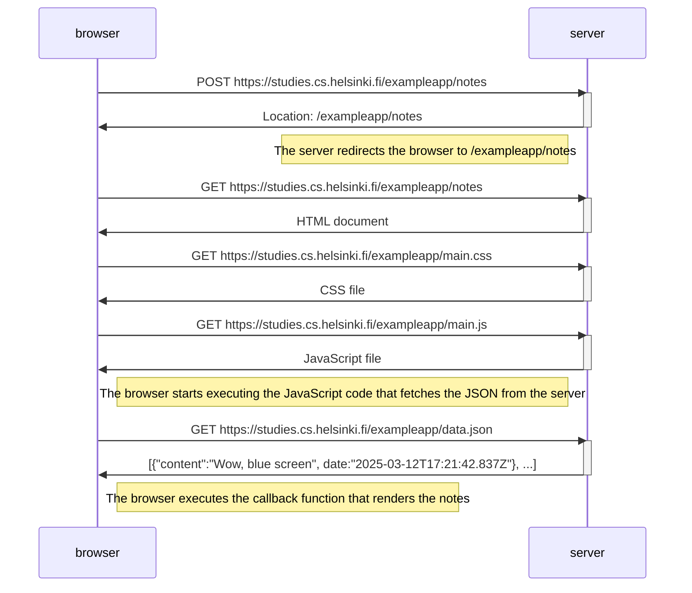

```mermaid
sequenceDiagram
    participant browser
    participant server

    browser->>server: POST https://studies.cs.helsinki.fi/exampleapp/notes
    activate server
    server->>browser: Location: /exampleapp/notes
    deactivate server
    
    Note left of server: The server redirects the browser to /exampleapp/notes

    browser->>server: GET https://studies.cs.helsinki.fi/exampleapp/notes
    activate server
    server->>browser: HTML document
    deactivate server

    browser->>server: GET https://studies.cs.helsinki.fi/exampleapp/main.css
    activate server   
    server->>browser: CSS file
    deactivate server

    browser->>server: GET https://studies.cs.helsinki.fi/exampleapp/main.js
    activate server   
    server->>browser: JavaScript file
    deactivate server

    Note right of browser: The browser starts executing the JavaScript code that fetches the JSON from the server
    
    browser->>server: GET https://studies.cs.helsinki.fi/exampleapp/data.json
    activate server   
    server->>browser: [{"content":"Wow, blue screen", date:"2025-03-12T17:21:42.837Z"}, ...]
    deactivate server
    
    Note right of browser: The browser executes the callback function that renders the notes
```